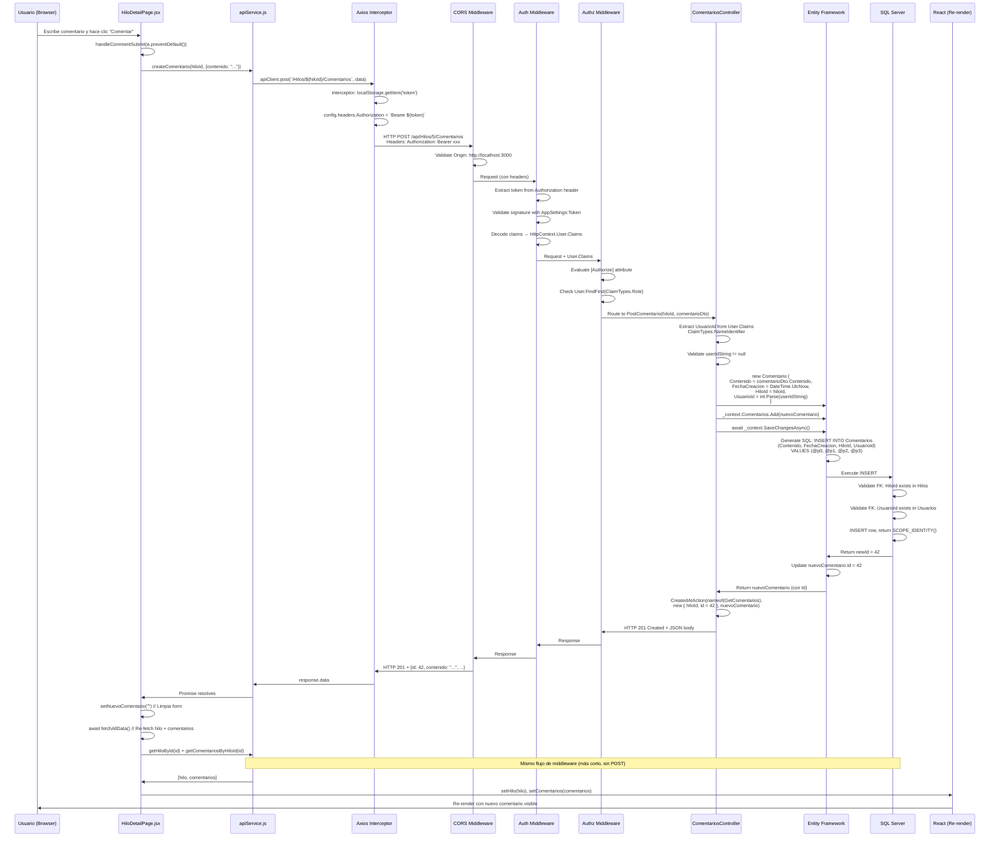

# Arquitectura del Sistema - GeneradorDeModelos
## Documento de Verdad Absoluta del Proyecto

> **IMPORTANTE**: Este documento representa el estado REAL y COMPLETO del sistema basado en análisis exhaustivo del código fuente. Sirve como fuente única de verdad para entender, mantener y evolucionar la aplicación.

---

## Índice

1. [Visión General del Sistema](#visión-general-del-sistema)
2. [Arquitectura de Datos y Flujo Dinámico](#arquitectura-de-datos-y-flujo-dinámico)
3. [Mapeo Detallado de Módulos y Patrones de Diseño](#mapeo-detallado-de-módulos-y-patrones-de-diseño)
4. [Análisis de Relaciones de Código Ocultas](#análisis-de-relaciones-de-código-ocultas)
5. [Esquema de Base de Datos Técnico](#esquema-de-base-de-datos-técnico)
6. [Diagramas de Secuencia y Flujo](#diagramas-de-secuencia-y-flujo)
7. [Estado Actual de la Lógica de Negocio](#estado-actual-de-la-lógica-de-negocio)
8. [Glosario de Términos Técnicos](#glosario-de-términos-técnicos)

---

## Visión General del Sistema

### Propósito del Sistema

**GeneradorDeModelos** (también referido como **FREAD** en el código) es una plataforma de foros de discusión tipo Reddit/Stack Overflow que implementa:

- **Sistema de Foros**: Categorías temáticas (Foros) donde los usuarios organizan discusiones
- **Hilos de Discusión**: Posts principales que inician conversaciones
- **Sistema de Comentarios**: Respuestas a hilos que permiten discusión anidada
- **Sistema de Votos**: Mecanismo simple de upvote/downvote en hilos
- **Gestión de Usuarios**: Registro, autenticación JWT, perfiles con fotos
- **Sistema de Roles y Permisos**: Roles (Administrador, Usuario) con menús dinámicos basados en BD
- **Panel de Administración**: Gestión de usuarios y cambio de roles

### Stack Tecnológico

**Backend:**
- **ASP.NET Core 9.0.9** (Web API)
- **Entity Framework Core 9.0.9** (Code-First ORM)
- **SQL Server** (Azure SQL Database)
- **JWT Bearer Authentication**
- **Swagger/OpenAPI** para documentación

**Frontend:**
- **React 18+** (Single Page Application)
- **React Router v6** (Client-side routing)
- **Axios** (HTTP Client)
- **Context API** (State management)
- **CSS Modules** (Estilos por componente)

**Base de Datos:**
- **SQL Server** (Azure)
- **Connection String**: `tcp:sqlserver-wb.database.windows.net,1433`
- **Database**: `fread` / `foro` (nombres alternativos en configuraciones)

---

## Arquitectura de Datos y Flujo Dinámico

### Cómo la Base de Datos Dicta el Comportamiento del Frontend

El sistema implementa un **patrón de menús dinámicos basados en base de datos**, donde la estructura de roles y permisos en SQL Server determina directamente qué elementos de navegación se muestran en la interfaz de usuario.

#### Flujo de Datos: Base de Datos → Frontend UI

```
┌─────────────────────────────────────────────────────────────────────┐
│ 1. SQL SERVER                                                        │
│    Tabla: Roles                                                      │
│    ├── ID: 1, NombreRol: "Administrador"                            │
│    └── ID: 2, NombreRol: "Usuario"                                  │
│                                                                      │
│    Tabla: MenuItems                                                  │
│    ├── ID: 1, Titulo: "Panel Admin", Url: "/popular", Icono: "..." │
│    ├── ID: 2, Titulo: "Foros", Url: "/foros", Icono: "..."         │
│    └── ID: 3, Titulo: "Mi Actividad", Url: "/mi-actividad", ...    │
│                                                                      │
│    Tabla: Rol_MenuItem_Permisos (Many-to-Many)                      │
│    ├── RolID: 1, MenuItemID: 1  (Admin → Panel Admin)              │
│    ├── RolID: 1, MenuItemID: 2  (Admin → Foros)                    │
│    ├── RolID: 2, MenuItemID: 2  (Usuario → Foros)                  │
│    └── RolID: 2, MenuItemID: 3  (Usuario → Mi Actividad)           │
└─────────────────────────────────────────────────────────────────────┘
                              ↓
┌─────────────────────────────────────────────────────────────────────┐
│ 2. AUTHENTICATION & AUTHORIZATION (JWT Token)                       │
│    Al hacer login:                                                   │
│    - AuthController.CreateToken() incluye:                          │
│      • ClaimTypes.NameIdentifier → Usuario.Id                       │
│      • ClaimTypes.Name → Usuario.NombreUsuario                      │
│      • ClaimTypes.Role → Usuario.Rol.NombreRol                      │
│                                                                      │
│    Token almacenado en localStorage del navegador                   │
└─────────────────────────────────────────────────────────────────────┘
                              ↓
┌─────────────────────────────────────────────────────────────────────┐
│ 3. FRONTEND: AuthContext.jsx (processToken)                         │
│    - Decodifica JWT token con jwtDecode()                           │
│    - Extrae: id, name, role                                         │
│    - Llama: getMenuItemsForUser() → /api/Auth/menu                 │
└─────────────────────────────────────────────────────────────────────┘
                              ↓
┌─────────────────────────────────────────────────────────────────────┐
│ 4. BACKEND: AuthController.GetUserMenu()                            │
│    - Extrae rol del token: User.FindFirst(ClaimTypes.Role)          │
│    - Consulta BD:                                                    │
│      context.Roles                                                  │
│        .Where(r => r.NombreRol == roleName)                         │
│        .Include(r => r.MenuItems)                                   │
│        .SelectMany(r => r.MenuItems)                                │
│    - Retorna: Array de MenuItem JSON                                │
└─────────────────────────────────────────────────────────────────────┘
                              ↓
┌─────────────────────────────────────────────────────────────────────┐
│ 5. FRONTEND: AuthContext recibe menuItems                           │
│    - setMenuItems(response.data)                                    │
│    - Expone menuItems en AuthContext.Provider                       │
└─────────────────────────────────────────────────────────────────────┘
                              ↓
┌─────────────────────────────────────────────────────────────────────┐
│ 6. UI: Navbar.jsx renderiza dinámicamente                           │
│    {menuItems.map(item => (                                         │
│      <Link key={item.id} to={item.url}>                            │
│        {item.titulo}                                                │
│      </Link>                                                        │
│    ))}                                                              │
│                                                                      │
│    RESULTADO:                                                        │
│    - Admin ve: "Panel Admin", "Foros"                               │
│    - Usuario ve: "Foros", "Mi Actividad"                            │
│    - Sin autenticación: Solo "Login"                                │
└─────────────────────────────────────────────────────────────────────┘
```

#### Implicaciones de Diseño

**Ventajas:**
- **Permisos centralizados**: Cambios en BD se reflejan inmediatamente sin deploy
- **Escalabilidad**: Agregar nuevos roles/menús solo requiere cambios en BD
- **Seguridad**: El backend valida permisos, el frontend solo renderiza

**Consideraciones:**
- **Performance**: Cada login requiere consulta adicional a BD para menú
- **Cache**: No hay caché del menú (se consulta en cada inicialización)
- **Sincronización**: Si se cambia un rol en BD, el usuario debe re-autenticarse

#### Código Clave: Transformación de Datos

**Backend - AuthController.GetUserMenu()** (Líneas 91-116):
```csharp
// 1. Extrae el rol del token JWT (ya validado por middleware)
var roleName = User.FindFirst(ClaimTypes.Role)?.Value;

// 2. Consulta EF Core con Include para eager loading
var role = await _context.Roles
    .Include(r => r.MenuItems)  // Carga la relación Many-to-Many
    .FirstOrDefaultAsync(r => r.NombreRol == roleName);

// 3. Proyecta solo los MenuItems
var menuItems = role.MenuItems.OrderBy(m => m.Id).ToList();

// 4. Serializa a JSON automáticamente por ASP.NET Core
return Ok(menuItems);
```

**Frontend - AuthContext.jsx** (Líneas 13-26):
```javascript
// 1. Decodifica token (sin validar firma, solo lectura)
const decodedToken = jwtDecode(tokenToProcess);

// 2. Extrae información del usuario
setUser({
    id: decodedToken.nameid || decodedToken['http://schemas...nameidentifier'],
    name: decodedToken.unique_name || decodedToken['http://schemas...name'],
    role: decodedToken.role || decodedToken['http://schemas...role']
});

// 3. Solicita menú específico del rol
const response = await getMenuItemsForUser();  // GET /api/Auth/menu
setMenuItems(response.data);  // Array: [{id, titulo, url, icono}, ...]
```

**Frontend - Navbar.jsx** (Líneas 42-47):
```javascript
// Renderizado condicional basado en estado global
{menuItems.map(item => (
    <Link key={item.id} to={item.url} className="nav-link">
        {item.titulo}
    </Link>
))}
```

---

## Mapeo Detallado de Módulos y Patrones de Diseño

### Backend - Estructura y Patrones

#### 0. **Services/** - Capa de Servicios (NUEVA) ✅

**Patrón de Diseño**: Service Layer Pattern - Separación de lógica de negocio de controladores

**Servicios Implementados**:

| Servicio | Interfaz | Responsabilidades |
|----------|----------|-------------------|
| `HiloService` | `IHiloService` | CRUD de hilos, validación de permisos, verificación de existencia |
| `ForoService` | `IForoService` | CRUD de foros, validación de permisos, verificación de existencia |
| `UsuarioService` | `IUsuarioService` | Gestión de usuarios, validación de unicidad (email, nombreUsuario), mapeo a DTOs sin PasswordHash |
| `VoteService` | `IVoteService` | Sistema de votos con prevención de múltiples votos, toggle de votos, actualización de contadores |

**Características**:
- ✅ Todos los métodos son `async/await` de extremo a extremo
- ✅ Validación de permisos centralizada en servicios
- ✅ Mapeo automático a DTOs de respuesta (sin PasswordHash)
- ✅ Registrados en DI container con `AddScoped` en `Program.cs`

**Ejemplo de Uso**:
```csharp
public class HilosController : ControllerBase
{
    private readonly IHiloService _hiloService;
    private readonly IVoteService _voteService;
    
    public HilosController(IHiloService hiloService, IVoteService voteService)
    {
        _hiloService = hiloService;
        _voteService = voteService;
    }
    
    [HttpPost("{id}/vote")]
    [Authorize]
    public async Task<IActionResult> VoteOnHilo(int id, [FromBody] VoteRequestDto voteRequest)
    {
        var usuarioId = int.Parse(User.FindFirst(ClaimTypes.NameIdentifier)?.Value);
        var nuevoVoteCount = await _voteService.VoteOnHiloAsync(id, usuarioId, voteRequest.Direction);
        return Ok(new { newVoteCount });
    }
}
```

#### 1. **Controllers/** - Patrón MVC (Model-View-Controller) - REFACTORIZADO

**Patrón de Diseño**: Service Layer Pattern - Los controladores delegan la lógica de negocio a servicios especializados

**Inyección de Dependencias**:
```csharp
// Controladores ahora usan servicios en lugar de acceder directamente a FreadContext:
public class XController : ControllerBase
{
    private readonly IXService _service;  // Servicio inyectado
    
    public XController(IXService service)  // Constructor injection
    {
        _service = service;
    }
}
```

**Controladores y sus Responsabilidades**:

| Controlador | Namespace | Responsabilidades | Patrón de Autorización | Servicios Utilizados |
|------------|-----------|-------------------|------------------------|---------------------|
| `AuthController` | `GeneradorDeModelos.Controllers` ✅ | Autenticación, registro, generación JWT, menús dinámicos | `[Authorize]` en `/menu` | Ninguno (acceso directo a DbContext) |
| `ForosController` | `GeneradorDeModelos.Controllers` ✅ | CRUD de foros, listado público | `[AllowAnonymous]` en GET, `[Authorize(Roles = "Administrador")]` en POST | `IForoService` |
| `HilosController` | `GeneradorDeModelos.Controllers` ✅ | CRUD de hilos, sistema de votos | `[AllowAnonymous]` en GET, `[Authorize]` en POST/PUT/DELETE | `IHiloService`, `IVoteService` |
| `ComentariosController` | `GeneradorDeModelos.Controllers` ✅ | CRUD de comentarios anidados en hilos | `[Authorize]` en POST, público en GET | Ninguno (acceso directo a DbContext) |
| `UsuariosController` | `GeneradorDeModelos.Controllers` ✅ | Perfil de usuario, subida de fotos | `[Authorize]` con validación de propiedad | `IUsuarioService` |
| `AdminController` | `GeneradorDeModelos.Controllers` ✅ | Gestión de usuarios, cambio de roles | `[Authorize(Roles = "Administrador")]` a nivel de clase | Ninguno (acceso directo a DbContext) |
| `MenuItemsController` | `GeneradorDeModelos.Controllers` ✅ | Menús dinámicos (alternativa a `/Auth/menu`) | `[Authorize]` | Ninguno (acceso directo a DbContext) |

✅ **REFACTORIZACIÓN COMPLETADA**: Todos los controladores ahora usan el namespace unificado `GeneradorDeModelos.Controllers`. Los controladores principales (Hilos, Foros, Usuarios) ahora usan servicios para separar la lógica de negocio.

#### 2. **Models/** - Domain Models y DbContext

**Patrón**: Code-First con Entity Framework Core

**FreadContext.cs** - Patrón Unit of Work:
```csharp
public partial class FreadContext : DbContext
{
    // DbSet representa cada tabla/agregado
    public virtual DbSet<Usuario> Usuarios { get; set; }
    public virtual DbSet<Foro> Foros { get; set; }
    public virtual DbSet<Hilo> Hilos { get; set; }
    public virtual DbSet<Comentario> Comentarios { get; set; }
    public virtual DbSet<Voto> Votos { get; set; }  // ✅ NUEVA ENTIDAD
    // ...
    
    // OnConfiguring() eliminado - Connection string se configura en Program.cs
    // Configuración de relaciones en OnModelCreating (Fluent API)
    protected override void OnModelCreating(ModelBuilder modelBuilder)
    {
        // Configuración explícita de relaciones, constraints, índices
        // Permite control fino sobre el esquema generado
    }
}
```

**Características del Modelo**:
- **Partial Classes**: Todos los modelos son `public partial class` permitiendo extensión
- **Navigation Properties**: Propiedades `virtual` para lazy loading (aunque se usa eager loading con `Include()`)
- **Data Annotations**: `[Key]`, `[Required]` en `Comentario.cs`, pero Fluent API en `FreadContext` para otros modelos
- **Valores por Defecto**: `DateTimeOffset?` con `HasDefaultValueSql("(sysdatetimeoffset())")`

**Nueva Entidad: Voto** ✅
- **Propósito**: Rastrear votos individuales de usuarios en hilos para prevenir múltiples votos
- **Campos**: `Id`, `UsuarioId`, `HiloId`, `Valor` (1 para upvote, -1 para downvote), `FechaVoto`
- **Índice Único**: `(UsuarioId, HiloId)` previene múltiples votos del mismo usuario en el mismo hilo
- **Relaciones**: `Cascade` delete con Usuario y Hilo

**Relaciones Configuradas**:

| Relación | Tipo | Comportamiento Delete | Constraint Name |
|----------|------|----------------------|-----------------|
| Usuario → Role | Many-to-One | `ClientSetNull` | `FK__Usuarios__RolID__619B8048` |
| Usuario → Foros | One-to-Many | Cascade implícito | `FK_Foros_Usuarios` |
| Usuario → Hilos | One-to-Many | `ClientSetNull` | `FK__Hilos__UsuarioID__68487DD7` |
| Usuario → Comentarios | One-to-Many | `Cascade` (migración) | `FK_Comentarios_Usuarios_UsuarioId` |
| Usuario → Votos | One-to-Many | `Cascade` | `FK_Votos_Usuarios` ✅ **NUEVA** |
| Foro → Hilos | One-to-Many | `ClientSetNull` | `FK__Hilos__ForoID__6754599E` |
| Hilo → Comentarios | One-to-Many | `Cascade` | `FK_Comentarios_Hilos_HiloId` |
| Hilo → Votos | One-to-Many | `Cascade` | `FK_Votos_Hilos` ✅ **NUEVA** |
| Role ↔ MenuItem | Many-to-Many | `ClientSetNull` | Tabla intermedia: `Rol_MenuItem_Permisos` |

#### 3. **Dtos/** - Data Transfer Objects

**Patrón**: DTO Pattern para separar modelos de dominio de contratos de API

**DTOs Implementados**:

| DTO | Propósito | Validador | Uso | Estado |
|-----|-----------|-----------|-----|--------|
| `UserRegisterDto` | Registro de usuario | Implícito (propiedades requeridas) | `POST /api/Auth/register` | ✅ Existente |
| `UserLoginDto` | Credenciales de login | Implícito | `POST /api/Auth/login` | ✅ Existente |
| `UsuarioResponseDto` | Respuesta de usuario (sin PasswordHash) | Ninguno | Respuestas de `GET /api/Usuarios/{id}`, `GET /api/Admin/users`, `POST /api/Auth/register` | ✅ **NUEVO** |
| `HiloCreateDto` | Creación de hilo | Implícito | `POST /api/Hilos` | ✅ Existente |
| `HiloUpdateDto` | Actualización de hilo | Ninguno | `PUT /api/Hilos/{id}` | ✅ **Movido desde inline** |
| `ComentarioCreateDto` | Creación de comentario | `[Required]` en modelo | `POST /api/Hilos/{id}/Comentarios` | ✅ Existente |
| `ForoUpdateDto` | Actualización de foro | Ninguno | `PUT /api/Foros/{id}` | ✅ **Movido desde inline** |
| `UsuarioUpdateDto` | Actualización de perfil | Ninguno | `PUT /api/Usuarios/{id}` | ✅ **Movido desde inline** |
| `RoleChangeDto` | Cambio de rol | Ninguno | `PUT /api/Admin/users/{id}/role` | ✅ **Movido desde inline** |
| `VoteRequestDto` | Voto en hilo | Ninguno | `POST /api/Hilos/{id}/vote` | ✅ **Movido desde inline** (antes `VoteRequest`) |

**Mejoras Implementadas**:
- ✅ Todos los DTOs ahora están en la carpeta `Dtos/` (no inline en controladores)
- ✅ `UsuarioResponseDto` asegura que NUNCA se envíe `PasswordHash` al frontend
- ⚠️ Falta validación con Data Annotations o FluentValidation (pendiente para Fase 3)

#### 4. **Program.cs** - Startup y Configuración

**Patrón**: Top-Level Statements (C# 10+), Configuration Pattern

**Pipeline de Middleware** (orden crítico):
```csharp
// 1. Swagger (solo Development)
if (app.Environment.IsDevelopment())
    app.UseSwagger();
    app.UseSwaggerUI(...);

// 2. CORS (debe ir antes de autenticación para preflight requests)
app.UseCors("MyCorsPolicy");

// 3. Autenticación (lee token JWT)
app.UseAuthentication();

// 4. Autorización (valida permisos basados en claims)
app.UseAuthorization();

// 5. Routing y endpoints
app.MapControllers();
```

**Configuración de Servicios**:
- **DbContext**: Scoped lifetime (una instancia por request)
- **JWT Authentication**: Configurado con clave simétrica desde `appsettings.json`
- **JSON Serialization**: `ReferenceHandler.IgnoreCycles` para evitar referencias circulares
- **CORS**: Política restrictiva solo para `http://localhost:3000`

**Problemas de Seguridad Detectados**:
- ⚠️ Connection string hardcodeada en `FreadContext.OnConfiguring()` (línea 30)
- ⚠️ Token JWT en `appsettings.json` (debe estar en User Secrets/Environment Variables)
- ⚠️ `ValidateIssuer = false` y `ValidateAudience = false` (no recomendado para producción)

### Frontend - Estructura y Patrones

#### 1. **src/services/apiService.js** - Service Layer Pattern

**Patrón**: Centralización de llamadas HTTP, Interceptor Pattern

**Axios Interceptor**:
```javascript
apiClient.interceptors.request.use(config => {
    const token = localStorage.getItem('token');
    if (token) {
        config.headers.Authorization = `Bearer ${token}`;
    }
    return config;
});
```

**Funciones Exportadas** (API Contract):
- Autenticación: `register()`, `login()`, `getMenuItemsForUser()`
- Foros: `getForos()`, `createForo()`, `updateForo()`, `deleteForo()`
- Hilos: `getHilos()`, `getHiloById()`, `createHilo()`, `deleteHilo()`, `voteOnHilo()`
- Comentarios: `getComentariosByHiloId()`, `createComentario()`
- Usuarios: `getUsuarioById()`, `updateUsuario()`, `uploadProfilePicture()`
- Admin: `getUsers()`, `deleteUser()`, `changeUserRole()`

**Problemas Detectados**:
- ❌ `getForoById()` definido pero no existe endpoint `GET /api/Foros/{id}`
- ❌ `getComentariosByUserId()` llama a endpoint inexistente
- ❌ URL base hardcodeada: `http://localhost:5153/api`

#### 2. **src/context/AuthContext.jsx** - Context API Pattern

**Patrón**: Provider Pattern, Singleton para estado global

**Estado Global**:
```javascript
{
    token: string | null,        // JWT token
    user: {                      // Información del usuario decodificada
        id: string,
        name: string,
        role: string
    } | null,
    menuItems: MenuItem[],       // Menú dinámico del usuario
    login: (token) => void,      // Función de login
    logout: () => void           // Función de logout
}
```

**Flujo de Inicialización**:
1. `useEffect` en mount verifica `localStorage.getItem('token')`
2. Si existe, llama `processToken()` que:
   - Decodifica JWT con `jwtDecode()`
   - Valida expiración (`decodedToken.exp * 1000 > Date.now()`)
   - Extrae claims del token
   - Hace request a `/api/Auth/menu` para obtener menú
   - Actualiza estado global

**Problemas Detectados**:
- ⚠️ `jwtDecode()` no valida firma del token (solo decodifica)
- ⚠️ No hay refresh token mechanism
- ⚠️ Token expira después de 1 día sin renovación automática

#### 3. **src/components/** - Component Composition Pattern

**Componentes Reutilizables**:
- `Navbar.jsx`: Navegación superior con menú dinámico y búsqueda
- `Sidebar.jsx`: Barra lateral estática (hardcoded, no dinámico)
- `PostCard.jsx`: Tarjeta de visualización de hilos
- `ProtectedRoute.jsx`: Higher-Order Component para rutas protegidas

**ProtectedRoute Pattern**:
```javascript
const ProtectedRoute = () => {
    const { user } = useAuth();
    if (!user) {
        return <Navigate to="/login" />;  // Redirect
    }
    return <Outlet />;  // Renderiza children routes
};
```

#### 4. **src/pages/** - Page Components Pattern

**Rutas Definidas** (App.js):
- Públicas: `/login`, `/register`
- Protegidas (requieren autenticación):
  - `/` → HomePage (lista de hilos)
  - `/foros` → ForosListPage
  - `/crear-foro` → CreateForoPage
  - `/crear-hilo` → CreateHiloPage
  - `/hilo/:id` → HiloDetailPage
  - `/perfil` → PerfilPage
  - `/popular` → AdminPage (mal nombrada, debería ser `/admin`)
  - `/mi-actividad` → MiActividadPage
- Catch-all: `*` → NotFoundPage

---

## Análisis de Relaciones de Código Ocultas

### 1. Middleware de Autenticación y su Impacto

**Flujo de Autenticación JWT**:

```
HTTP Request → CORS Middleware → Authentication Middleware → Authorization Middleware → Controller
```

**Authentication Middleware** (`app.UseAuthentication()`):
- Lee header `Authorization: Bearer <token>`
- Valida firma del token usando `AppSettings:Token` como clave
- Extrae Claims del token y los pone en `HttpContext.User`
- NO valida expiración aquí (eso lo hace el frontend con `jwtDecode`)

**Authorization Middleware** (`app.UseAuthorization()`):
- Evalúa atributos `[Authorize]` y `[Authorize(Roles = "...")]`
- Para `[Authorize(Roles = "Administrador")]`:
  - Busca claim `ClaimTypes.Role` en `HttpContext.User.Claims`
  - Compara valor con "Administrador"
  - Si no coincide, retorna `401 Unauthorized` o `403 Forbidden`

**Impacto en Controladores**:

| Atributo | Middleware Evalúa | Controlador Accede |
|----------|-------------------|-------------------|
| `[AllowAnonymous]` | No valida autenticación | `User` puede ser null |
| `[Authorize]` | Token válido requerido | `User.FindFirst(ClaimTypes.NameIdentifier)` disponible |
| `[Authorize(Roles = "X")]` | Token + Rol "X" requerido | `User.IsInRole("X")` retorna true |

**Código Oculto**: Los controladores asumen que `User.FindFirst(ClaimTypes.NameIdentifier)` siempre retorna un valor cuando `[Authorize]` está presente, pero no hay validación explícita:

```csharp
// En múltiples controladores:
var userIdString = User.FindFirst(ClaimTypes.NameIdentifier)?.Value;
var nuevoForo = new Foro { UsuarioId = int.Parse(userIdString) };  // ⚠️ Puede ser null
```

**Riesgo**: Si el token no tiene el claim (caso edge), `int.Parse(null)` lanza `ArgumentNullException`.

### 2. Inconsistencias de Namespace ✅ RESUELTO

**Problema Resuelto**: Todos los controladores ahora usan el namespace unificado `GeneradorDeModelos.Controllers`.

| Controlador | Namespace Actual | Estado |
|------------|----------------|--------|
| `AuthController` | `GeneradorDeModelos.Controllers` | ✅ Correcto |
| `HilosController` | `GeneradorDeModelos.Controllers` | ✅ Correcto |
| `MenuItemsController` | `GeneradorDeModelos.Controllers` | ✅ Correcto |
| `ForosController` | `GeneradorDeModelos.Controllers` | ✅ **CORREGIDO** |
| `ComentariosController` | `GeneradorDeModelos.Controllers` | ✅ **CORREGIDO** |
| `UsuariosController` | `GeneradorDeModelos.Controllers` | ✅ **CORREGIDO** |
| `AdminController` | `GeneradorDeModelos.Controllers` | ✅ **CORREGIDO** |

**Cambio Realizado**: Refactorización completa - todos los controladores ahora usan el namespace correcto.

### 3. Dependencias Implícitas entre Controladores

**AuthController y MenuItemsController**:
- Ambos exponen endpoints para obtener menús: `/api/Auth/menu` y `/api/MenuItems`
- **AuthController.GetUserMenu()**: Usa `AuthController` como contexto, más lógico
- **MenuItemsController.GetMenuItemsForUser()**: Usa `MenuItemsController`, menos intuitivo
- **Problema**: Dos endpoints hacen lo mismo, puede causar confusión

**HilosController y ComentariosController**:
- `ComentariosController` usa ruta anidada: `/api/Hilos/{hiloId}/[controller]`
- Esto significa que `ComentariosController` está conceptualmente subordinado a `HilosController`
- **Impacto**: Si se elimina un hilo, los comentarios se eliminan en cascada (configurado en BD)

### 4. Relación entre FreadContext y Migraciones ✅ RESUELTO

**OnConfiguring() Eliminado**:
```csharp
// OnConfiguring eliminado - La connection string se configura mediante inyección de dependencias en Program.cs
// Esto previene que se exponga información sensible en el código fuente
```

**Solución Implementada**: El método `OnConfiguring()` ha sido eliminado completamente. La connection string se configura exclusivamente en `Program.cs` mediante inyección de dependencias desde `appsettings.json`. Esto elimina el riesgo de seguridad de tener credenciales hardcodeadas en el código fuente.

### 5. Flujo de Datos: Entity Framework Include() y N+1 Queries

**Patrón Detectado**: Uso consistente de `Include()` para eager loading:

```csharp
// HilosController.GetHilos()
_context.Hilos
    .Include(h => h.Usuario)      // JOIN con Usuarios
    .Include(h => h.Foro)         // JOIN con Foros
    .OrderByDescending(h => h.FechaCreacion)
    .ToListAsync();
```

**SQL Generado** (aproximado):
```sql
SELECT h.*, u.*, f.*
FROM Hilos h
LEFT JOIN Usuarios u ON h.UsuarioID = u.ID
LEFT JOIN Foros f ON h.ForoID = f.ID
ORDER BY h.FechaCreacion DESC
```

**Ventaja**: Evita N+1 queries (una query por hilo para cargar Usuario y Foro).

**Problema Potencial**: Si hay muchos hilos, la query puede ser lenta. No hay paginación implementada.

---

## Esquema de Base de Datos Técnico

### Diagrama ER Detallado con Tipos de Datos

```mermaid
erDiagram
    Usuarios ||--o{ Foros : "crea"
    Usuarios ||--o{ Hilos : "crea"
    Usuarios ||--o{ Comentarios : "escribe"
    Usuarios ||--o{ Posts : "escribe"
    Usuarios }o--|| Roles : "tiene"
    
    Foros ||--o{ Hilos : "contiene"
    
    Hilos ||--o{ Comentarios : "tiene"
    Hilos ||--o{ Posts : "tiene"
    
    Roles }o--o{ MenuItems : "accede_via"
    
    Usuarios {
        int ID PK "Identity(1,1)"
        nvarchar_100 Email UK "NOT NULL, UNIQUE INDEX"
        nvarchar_255 PasswordHash "NOT NULL"
        nvarchar_50 NombreUsuario UK "NOT NULL, UNIQUE INDEX"
        datetimeoffset FechaRegistro "NULL, DEFAULT sysdatetimeoffset()"
        int RolID FK "NOT NULL"
        nvarchar_max ProfilePictureUrl "NULL, AÑADIDO EN MIGRACIÓN"
        INDEX IX_Usuarios_RolID
    }
    
    Roles {
        int ID PK "Identity(1,1)"
        nvarchar_50 NombreRol "NOT NULL"
    }
    
    Foros {
        int ID PK "Identity(1,1)"
        nvarchar_100 NombreForo "NOT NULL"
        nvarchar_255 Descripcion "NULL"
        int UsuarioId FK "NULL, FK_Foros_Usuarios"
        INDEX IX_Foros_UsuarioId
    }
    
    Hilos {
        int ID PK "Identity(1,1)"
        nvarchar_150 Titulo "NOT NULL"
        datetimeoffset FechaCreacion "NULL, DEFAULT sysdatetimeoffset()"
        int ForoID FK "NOT NULL, FK__Hilos__ForoID__6754599E, ON DELETE ClientSetNull"
        int UsuarioID FK "NOT NULL, FK__Hilos__UsuarioID__68487DD7, ON DELETE ClientSetNull"
        nvarchar_max Contenido "NULL, AÑADIDO EN MIGRACIÓN"
        int Votos "NOT NULL, DEFAULT 0, AÑADIDO EN MIGRACIÓN"
        INDEX IX_Hilos_ForoID
        INDEX IX_Hilos_UsuarioID
    }
    
    Comentarios {
        int Id PK "Identity(1,1)"
        nvarchar_max Contenido "NOT NULL, [Required]"
        datetime2 FechaCreacion "NOT NULL"
        int UsuarioId FK "NOT NULL, FK_Comentarios_Usuarios_UsuarioId, ON DELETE Cascade"
        int HiloId FK "NOT NULL, FK_Comentarios_Hilos_HiloId, ON DELETE Cascade"
        INDEX IX_Comentarios_HiloId
        INDEX IX_Comentarios_UsuarioId
    }
    
    Posts {
        int ID PK "Identity(1,1)"
        nvarchar_max ContenidoMensaje "NOT NULL"
        datetimeoffset FechaCreacion "NULL, DEFAULT sysdatetimeoffset()"
        int HiloID FK "NOT NULL, FK__Posts__HiloID__6C190EBB, ON DELETE ClientSetNull"
        int UsuarioID FK "NOT NULL, FK__Posts__UsuarioID__6D0D32F4, ON DELETE ClientSetNull"
        INDEX IX_Posts_HiloID
        INDEX IX_Posts_UsuarioID
    }
    
    MenuItems {
        int ID PK "Identity(1,1)"
        nvarchar_50 Titulo "NOT NULL"
        nvarchar_200 Url "NOT NULL"
        nvarchar_50 Icono "NULL"
    }
    
    Rol_MenuItem_Permisos {
        int RolID PK_FK "NOT NULL, FK__Rol_MenuI__RolID__71D1E811, ON DELETE ClientSetNull"
        int MenuItemID PK_FK "NOT NULL, FK__Rol_MenuI__MenuI__72C60C4A, ON DELETE ClientSetNull"
        PRIMARY_KEY PK__Rol_Menu__C1B73DA11E4A5809 "RolID, MenuItemID"
        INDEX IX_Rol_MenuItem_Permisos_MenuItemID
    }
```

### Restricciones y Constraints Detallados

#### Índices Únicos

| Tabla | Columna(s) | Nombre del Índice | Propósito |
|-------|-----------|-------------------|-----------|
| `Usuarios` | `NombreUsuario` | `UQ__Usuarios__6B0F5AE081C744C4` | Garantiza nombres de usuario únicos |
| `Usuarios` | `Email` | `UQ__Usuarios__A9D105345F54D739` | Garantiza emails únicos |

#### Claves Foráneas y Comportamiento de Delete

| FK | Tabla Origen | Tabla Destino | On Delete | Constraint Name |
|----|--------------|---------------|-----------|-----------------|
| `RolID` | Usuarios | Roles | `ClientSetNull` | `FK__Usuarios__RolID__619B8048` |
| `UsuarioId` | Foros | Usuarios | (No especificado, probablemente `NoAction`) | `FK_Foros_Usuarios` |
| `ForoID` | Hilos | Foros | `ClientSetNull` | `FK__Hilos__ForoID__6754599E` |
| `UsuarioID` | Hilos | Usuarios | `ClientSetNull` | `FK__Hilos__UsuarioID__68487DD7` |
| `HiloId` | Comentarios | Hilos | `Cascade` ⚠️ | `FK_Comentarios_Hilos_HiloId` |
| `UsuarioId` | Comentarios | Usuarios | `Cascade` ⚠️ | `FK_Comentarios_Usuarios_UsuarioId` |
| `HiloID` | Posts | Hilos | `ClientSetNull` | `FK__Posts__HiloID__6C190EBB` |
| `UsuarioID` | Posts | Usuarios | `ClientSetNull` | `FK__Posts__UsuarioID__6D0D32F4` |
| `RolID` | Rol_MenuItem_Permisos | Roles | `ClientSetNull` | `FK__Rol_MenuI__RolID__71D1E811` |
| `MenuItemID` | Rol_MenuItem_Permisos | MenuItems | `ClientSetNull` | `FK__Rol_MenuI__MenuI__72C60C4A` |

⚠️ **IMPORTANTE**: `Comentarios` tiene `ON DELETE CASCADE`, lo que significa que si se elimina un `Hilo` o un `Usuario`, todos sus comentarios se eliminan automáticamente. Esto es diferente de `Hilos` y `Posts` que usan `ClientSetNull`.

#### Valores por Defecto

| Tabla | Columna | Valor por Defecto | Tipo |
|-------|---------|-------------------|------|
| `Usuarios` | `FechaRegistro` | `sysdatetimeoffset()` | `datetimeoffset` |
| `Hilos` | `FechaCreacion` | `sysdatetimeoffset()` | `datetimeoffset` |
| `Posts` | `FechaCreacion` | `sysdatetimeoffset()` | `datetimeoffset` |

**Nota**: `Comentarios.FechaCreacion` NO tiene valor por defecto en BD, se establece en código (`DateTime.UtcNow`).

### Migraciones Aplicadas

| Migración | Fecha | Cambios |
|-----------|-------|---------|
| `20250929074437_InitialCreate` | 2025-09-29 | Esquema inicial completo |
| `20250930065721_AddProfilePictureToUsuario` | 2025-09-30 | Agregó `ProfilePictureUrl` a `Usuarios` |
| `20250930075422_AddContenidoAndVotosToHilos` | 2025-09-30 | Agregó `Contenido` y `Votos` a `Hilos` |

---

## Diagramas de Secuencia y Flujo

### Diagrama de Secuencia: Crear un Comentario (Flujo Completo)



### Diagrama de Flujo: Autenticación y Carga de Menú

```mermaid
flowchart TD
    A[Usuario ingresa credenciales] --> B[LoginPage.jsx: handleSubmit]
    B --> C[apiService.login: POST /api/Auth/login]
    C --> D{AuthController.Login}
    D --> E[Query BD: Usuario por NombreUsuario]
    E --> F{Usuario existe?}
    F -->|No| G[Return 401 Unauthorized]
    F -->|Sí| H[Hash password con SHA512]
    H --> I{Password hash coincide?}
    I -->|No| G
    I -->|Sí| J[AuthController.CreateToken]
    J --> K[Generar JWT con claims:<br/>- NameIdentifier: Usuario.Id<br/>- Name: Usuario.NombreUsuario<br/>- Role: Usuario.Rol.NombreRol]
    K --> L[Return 200 OK + JWT token string]
    L --> M[AuthContext.login: localStorage.setItem token]
    M --> N[AuthContext.processToken]
    N --> O[jwtDecode: Extraer claims del token]
    O --> P{Token expirado?}
    P -->|Sí| Q[localStorage.removeItem token]
    P -->|No| R[setUser: {id, name, role}]
    R --> S[apiService.getMenuItemsForUser: GET /api/Auth/menu]
    S --> T[AuthController.GetUserMenu]
    T --> U[Extract role from token: User.FindFirst Role]
    U --> V[Query BD: Roles.Include MenuItems<br/>Where NombreRol == roleName]
    V --> W[Return MenuItems array]
    W --> X[AuthContext.setMenuItems response.data]
    X --> Y[AuthContext.Provider value: {user, menuItems, ...}]
    Y --> Z[Navbar.jsx: Render menuItems.map Link]
    Z --> AA[UI muestra menú dinámico según rol]
    
    style G fill:#ff9999
    style Q fill:#ff9999
    style AA fill:#99ff99
```

### Diagrama de Flujo: Sistema de Votos en Hilos

```mermaid
flowchart LR
    A[Usuario hace clic en botón voto] --> B{¿Usuario autenticado?}
    B -->|No| C[Redirigir a /login]
    B -->|Sí| D[Frontend: voteOnHilo hiloId, {direction: up/down}]
    D --> E[POST /api/Hilos/{id}/vote<br/>Authorization: Bearer token]
    E --> F[HilosController.VoteOnHilo]
    F --> G[Query BD: Hilos.FindAsync id]
    G --> H{Hilo existe?}
    H -->|No| I[Return 404 NotFound]
    H -->|Sí| J{direction == up?}
    J -->|Sí| K[hilo.Votos++]
    J -->|No| L{direction == down?}
    L -->|Sí| M[hilo.Votos--]
    L -->|No| N[No cambia votos]
    K --> O[SaveChangesAsync]
    M --> O
    N --> O
    O --> P[Return 200 OK + {newVoteCount: hilo.Votos}]
    P --> Q[Frontend actualiza UI con nuevo contador]
    
    style I fill:#ff9999
    style Q fill:#99ff99
```

---

## Estado Actual de la Lógica de Negocio

### Resumen por Controlador

#### AuthController (`GeneradorDeModelos.Controllers`)

| Método | HTTP | Endpoint | Lógica Actual | Problemas/Mejoras Necesarias |
|--------|------|----------|---------------|------------------------------|
| `Register` | POST | `/api/Auth/register` | 1. Valida NombreUsuario único<br>2. Valida Email único<br>3. Busca rol "Usuario" por defecto<br>4. Hash password SHA512<br>5. Crea Usuario<br>6. Retorna Usuario completo (⚠️ incluye PasswordHash) | ❌ Retorna PasswordHash en respuesta<br>❌ No valida formato de email<br>❌ SHA512 sin salt (inseguro, debería usar BCrypt/PBKDF2)<br>❌ No hay validación de fortaleza de contraseña |
| `Login` | POST | `/api/Auth/login` | 1. Busca Usuario por NombreUsuario<br>2. Hash password ingresada<br>3. Compara hashes<br>4. Genera JWT token<br>5. Retorna solo token string | ⚠️ Mensaje genérico "Usuario o contraseña incorrectos" (no especifica cuál)<br>❌ No hay rate limiting (vulnerable a brute force)<br>❌ Token expira en 1 día fijo, sin refresh mechanism |
| `GetUserMenu` | GET | `/api/Auth/menu` | 1. Extrae rol de token<br>2. Query Roles con Include MenuItems<br>3. Retorna MenuItems ordenados por Id | ✅ Lógica correcta<br>⚠️ Ordenar por Id puede no ser ideal (debería tener campo Orden) |
| `CreateToken` (privado) | - | - | Genera JWT con claims estándar, expiración 1 día, firma HMAC SHA512 | ✅ Funcional<br>⚠️ ValidateIssuer/Audience deshabilitados |

**Lógica a Mover a Servicio**:
- Hash de contraseñas → `IPasswordHasherService`
- Generación de tokens → `ITokenService`
- Validación de usuario único → `IUserService`

#### ForosController (`FRED.Controllers` ⚠️)

| Método | HTTP | Endpoint | Lógica Actual | Problemas/Mejoras Necesarias |
|--------|------|----------|---------------|------------------------------|
| `GetForos` | GET | `/api/Foros` | 1. Query Foros con Include Usuario<br>2. Retorna lista completa | ❌ No hay paginación (puede ser lento con muchos foros)<br>❌ No hay filtrado/búsqueda<br>⚠️ Retorna Usuario completo (puede exponer datos sensibles) |
| `CreateForo` | POST | `/api/Foros` | 1. Valida [Authorize(Roles = "Administrador")]<br>2. Extrae UsuarioId del token<br>3. Crea Foro con UsuarioId<br>4. Retorna Foro creado | ✅ Lógica correcta<br>⚠️ No valida si Foro con mismo nombre ya existe<br>❌ DTO inline `ForoUpdateDto` debería ser `ForoCreateDto` |
| `DeleteForo` | DELETE | `/api/Foros/{id}` | 1. Valida [Authorize]<br>2. Busca Foro por Id<br>3. Valida propiedad (UsuarioId coincide) o rol Admin<br>4. Elimina Foro | ⚠️ No valida si Foro tiene Hilos asociados (puede dejar Hilos huérfanos por ClientSetNull)<br>❌ No hay soft delete |
| `UpdateForo` | PUT | `/api/Foros/{id}` | 1. Valida propiedad o Admin<br>2. Actualiza NombreForo y Descripcion<br>3. SaveChanges | ✅ Lógica correcta<br>⚠️ No valida longitud de campos<br>⚠️ No valida si nuevo nombre ya existe |
| `GetForosByUsuario` | GET | `/api/Foros/ByUsuario/{userId}` | 1. Query Foros filtrado por UsuarioId<br>2. Ordena por NombreForo | ✅ Funcional<br>⚠️ No valida que userId exista<br>⚠️ No valida que usuario autenticado tenga permiso de ver foros de otro usuario |

**Lógica a Mover a Servicio**:
- Validación de permisos → `IAuthorizationService`
- Lógica de negocio de Foros → `IForoService`

#### HilosController (`GeneradorDeModelos.Controllers`)

| Método | HTTP | Endpoint | Lógica Actual | Problemas/Mejoras Necesarias |
|--------|------|----------|---------------|------------------------------|
| `GetHilos` | GET | `/api/Hilos` | 1. Query Hilos con Include Usuario y Foro<br>2. Ordena por FechaCreacion DESC | ❌ No hay paginación<br>❌ No hay filtrado por Foro<br>⚠️ Retorna entidades completas (puede ser pesado) |
| `GetHilo` | GET | `/api/Hilos/{id}` | 1. Query Hilo por Id con Include<br>2. Retorna Hilo o 404 | ✅ Funcional<br>⚠️ No incluye Comentarios (se cargan por separado) |
| `CreateHilo` | POST | `/api/Hilos` | 1. Extrae UsuarioId del token<br>2. Crea Hilo con Votos=0, FechaCreacion=Now<br>3. Retorna Hilo creado | ✅ Lógica correcta<br>⚠️ No valida que ForoId exista<br>⚠️ No valida longitud de Titulo (150 max en BD) |
| `UpdateHilo` | PUT | `/api/Hilos/{id}` | 1. Valida propiedad o Admin<br>2. Actualiza Titulo y Contenido<br>3. SaveChanges | ✅ Funcional<br>⚠️ No valida longitud |
| `DeleteHilo` | DELETE | `/api/Hilos/{id}` | 1. Valida propiedad o Admin<br>2. Elimina Hilo<br>3. SaveChanges | ⚠️ Comentarios se eliminan en cascada (OK)<br>⚠️ Posts se quedan con HiloId=null por ClientSetNull (puede ser problema) |
| `GetHilosByUsuario` | GET | `/api/Hilos/ByUsuario/{userId}` | 1. Query Hilos filtrado por UsuarioId<br>2. Ordena por FechaCreacion DESC | ⚠️ Mismo problema de permisos que GetForosByUsuario |
| `VoteOnHilo` | POST | `/api/Hilos/{id}/vote` | 1. Busca Hilo<br>2. Incrementa/decrementa Votos según direction<br>3. SaveChanges<br>4. Retorna nuevo contador | ❌ **PROBLEMA CRÍTICO**: No valida si usuario ya votó (permite múltiples votos)<br>❌ No hay tabla de votos individuales (debería tener tabla UserHiloVotes)<br>❌ Direction puede ser cualquier string (solo valida "up"/"down" parcialmente) |

**Lógica a Mover a Servicio**:
- Sistema de votos → `IVoteService` (con validación de votos únicos)
- Validación de permisos → `IAuthorizationService`
- Lógica de negocio de Hilos → `IHiloService`

#### ComentariosController (`FRED.Controllers` ⚠️)

| Método | HTTP | Endpoint | Lógica Actual | Problemas/Mejoras Necesarias |
|--------|------|----------|---------------|------------------------------|
| `GetComentarios` | GET | `/api/Hilos/{hiloId}/Comentarios` | 1. Query Comentarios filtrado por HiloId<br>2. Include Usuario<br>3. Ordena por FechaCreacion ASC | ✅ Funcional<br>⚠️ No hay paginación (puede ser lento con muchos comentarios) |
| `PostComentario` | POST | `/api/Hilos/{hiloId}/Comentarios` | 1. Extrae UsuarioId del token<br>2. Valida hiloId de URL<br>3. Crea Comentario con DateTime.UtcNow<br>4. Retorna Comentario creado | ✅ Lógica correcta<br>⚠️ No valida que HiloId exista antes de crear<br>⚠️ FechaCreacion usa UtcNow pero modelo es DateTime (no DateTimeOffset) - inconsistencia |

**Lógica a Mover a Servicio**:
- Validación de Hilo existente → `IHiloService`
- Lógica de negocio de Comentarios → `IComentarioService`

#### UsuariosController (`FRED.Controllers` ⚠️)

| Método | HTTP | Endpoint | Lógica Actual | Problemas/Mejoras Necesarias |
|--------|------|----------|---------------|------------------------------|
| `GetUsuario` | GET | `/api/Usuarios/{id}` | 1. Busca Usuario por Id<br>2. Retorna Usuario completo | ❌ Retorna PasswordHash (riesgo de seguridad)<br>⚠️ No valida permisos (cualquiera autenticado puede ver cualquier usuario) |
| `PutUsuario` | PUT | `/api/Usuarios/{id}` | 1. Valida que usuario autenticado == id<br>2. Actualiza NombreUsuario y Email si proporcionados<br>3. Lógica de cambio de password comentada (no implementada)<br>4. SaveChanges | ❌ Cambio de password NO implementado (código comentado)<br>⚠️ No valida si nuevo Email/NombreUsuario ya existe<br>⚠️ No valida formato de email |
| `UploadProfilePicture` | POST | `/api/Usuarios/{id}/uploadPicture` | 1. Valida propiedad<br>2. Crea directorio si no existe<br>3. Genera nombre único con Guid<br>4. Guarda archivo en wwwroot/uploads/profile_pictures<br>5. Actualiza ProfilePictureUrl en BD | ✅ Funcional<br>⚠️ No valida tipo de archivo (puede subir cualquier archivo)<br>⚠️ No valida tamaño de archivo<br>⚠️ No redimensiona imágenes<br>⚠️ Archivos se guardan en wwwroot (no escalable, debería usar blob storage) |

**Lógica a Mover a Servicio**:
- Gestión de archivos → `IFileStorageService`
- Validación de usuario → `IUserService`
- Cambio de password → `IPasswordService`

#### AdminController (`FRED.Controllers` ⚠️)

| Método | HTTP | Endpoint | Lógica Actual | Problemas/Mejoras Necesarias |
|--------|------|----------|---------------|------------------------------|
| `GetUsers` | GET | `/api/Admin/users` | 1. Query Usuarios con Include Rol<br>2. Retorna lista completa | ❌ Retorna PasswordHash de todos los usuarios<br>❌ No hay paginación<br>⚠️ [Authorize(Roles = "Administrador")] a nivel de clase (correcto) |
| `DeleteUser` | DELETE | `/api/Admin/users/{id}` | 1. Busca Usuario<br>2. Valida que no se elimine a sí mismo<br>3. Elimina Usuario<br>4. SaveChanges | ⚠️ No valida dependencias (Foros, Hilos, Comentarios del usuario)<br>⚠️ Eliminación en cascada puede ser peligrosa |
| `ChangeUserRole` | PUT | `/api/Admin/users/{id}/role` | 1. Busca Usuario<br>2. Valida que NewRoleId existe<br>3. Actualiza RolId<br>4. SaveChanges | ✅ Funcional<br>⚠️ No hay auditoría de cambios de rol<br>⚠️ Usuario debe re-autenticarse para ver nuevo menú |

**Lógica a Mover a Servicio**:
- Gestión de usuarios admin → `IAdminService`
- Auditoría → `IAuditService`

#### MenuItemsController (`GeneradorDeModelos.Controllers`)

| Método | HTTP | Endpoint | Lógica Actual | Problemas/Mejoras Necesarias |
|--------|------|----------|---------------|------------------------------|
| `GetMenuItemsForUser` | GET | `/api/MenuItems` | 1. Extrae rol del token<br>2. Query Roles con SelectMany MenuItems<br>3. Retorna MenuItems | ⚠️ Duplica funcionalidad de `/api/Auth/menu`<br>✅ Usa SelectMany (más eficiente que Include + ToList) |

---

## Glosario de Términos Técnicos

| Término | Definición en el Contexto del Proyecto |
|---------|----------------------------------------|
| **FreadContext** | DbContext de Entity Framework que actúa como Unit of Work para todas las operaciones de base de datos |
| **Claim** | Fragmento de información sobre el usuario almacenado en el token JWT (ej: NameIdentifier, Role) |
| **Navigation Property** | Propiedad virtual en un modelo de EF que representa una relación con otra entidad (ej: `Usuario.Foros`) |
| **Eager Loading** | Cargar relaciones relacionadas en una sola query usando `Include()` para evitar N+1 queries |
| **DTO (Data Transfer Object)** | Objeto simple que transfiere datos entre capas, separado del modelo de dominio |
| **Many-to-Many** | Relación donde una entidad puede estar relacionada con muchas de otra, y viceversa. Implementada mediante tabla intermedia (ej: `Rol_MenuItem_Permisos`) |
| **Cascade Delete** | Comportamiento donde eliminar una entidad padre elimina automáticamente las entidades hijas |
| **ClientSetNull** | Comportamiento de EF donde al eliminar una entidad padre, las claves foráneas en las hijas se establecen en NULL (en lugar de eliminar) |
| **Interceptor** | Función que se ejecuta automáticamente antes/después de una operación (ej: Axios interceptor añade token a cada request) |
| **Protected Route** | Ruta de React Router que requiere autenticación, redirige a login si el usuario no está autenticado |

---

## Conclusiones y Recomendaciones

### Estado Actual del Código

**Fortalezas**:
- ✅ Arquitectura clara de separación frontend/backend
- ✅ Uso consistente de Entity Framework con eager loading
- ✅ Sistema de menús dinámicos bien implementado
- ✅ Autenticación JWT funcional

**Debilidades Críticas**:
- ❌ Lógica de negocio mezclada en controladores (debe moverse a servicios)
- ❌ Inconsistencias de namespace (`FRED.Controllers` vs `GeneradorDeModelos.Controllers`)
- ❌ Sistema de votos permite múltiples votos del mismo usuario
- ❌ Falta validación en múltiples endpoints
- ❌ PasswordHash expuesto en respuestas
- ❌ Connection string y tokens hardcodeados (riesgo de seguridad)

### Próximos Pasos Recomendados

1. **Refactorización de Lógica de Negocio**:
   - Crear capa de servicios (`Services/`)
   - Mover lógica de controladores a servicios
   - Implementar interfaces para testabilidad

2. **Corrección de Namespaces**:
   - Unificar todos los controladores a `GeneradorDeModelos.Controllers`

3. **Mejora de Seguridad**:
   - Mover secrets a User Secrets/Environment Variables
   - Implementar BCrypt para hashing de passwords
   - Remover PasswordHash de respuestas JSON
   - Agregar rate limiting

4. **Sistema de Votos**:
   - Crear tabla `UserHiloVotes` para rastrear votos individuales
   - Validar que usuario solo vote una vez por hilo

5. **Validación y Paginación**:
   - Implementar FluentValidation para DTOs
   - Agregar paginación a todos los endpoints de listado

---

*Documento generado mediante análisis exhaustivo del código fuente. Última actualización: Basado en commit actual del repositorio.*
